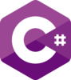
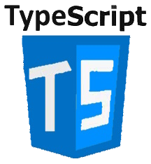
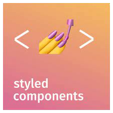
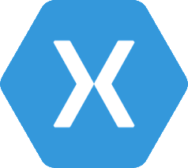
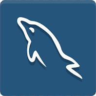
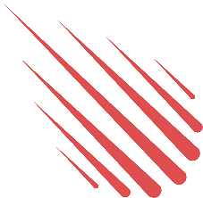
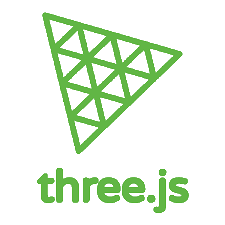
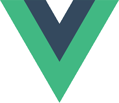
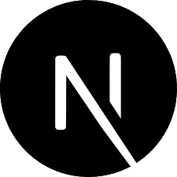

    <h1>  </h1>
    My name's Damien, i'm a 19 Years old 3rd year apprentice fullstack developer  
    I love and I'm passionated about software and web development !  
    ✉️ You can reach me here at <a href="mailto:damien.loup14@gmail.com">damien.loup14@gmail.com </a>    
    &nbsp;&nbsp;&nbsp;&nbsp;
    &nbsp;&nbsp;&nbsp;&nbsp;
    &nbsp;&nbsp;&nbsp;&nbsp;

    

        <dl><dd><dl><dd><dl><dd>
        <h2> What i know </h2>
        <!-- Languages -->
        

            
            
            
            
            
            
            
            
            
            
            
            
            
        
 
        <!-- Libraries / Frameworks -->
        

            
            
            
            
            
            
            
        
 
        <!-- Engines -->
        

        
 
        <h2> What I want to learn </h2>
        <!-- Languages -->
        

            
            
            
            
        
 
        <!-- Libraries / Frameworks -->
        

            
            
            
            
            
            
            
            
            
            
            
            
        
 
        <!-- Engines -->
        

            
            
        

        </dd></dl></dd></dl></dd></dl>
    

     
    
    &nbsp;&nbsp;&nbsp;&nbsp;
    

    <h2> Other links </h2>
    <a href="https://dam277.github.io/dam277/">My portfolio</a>

